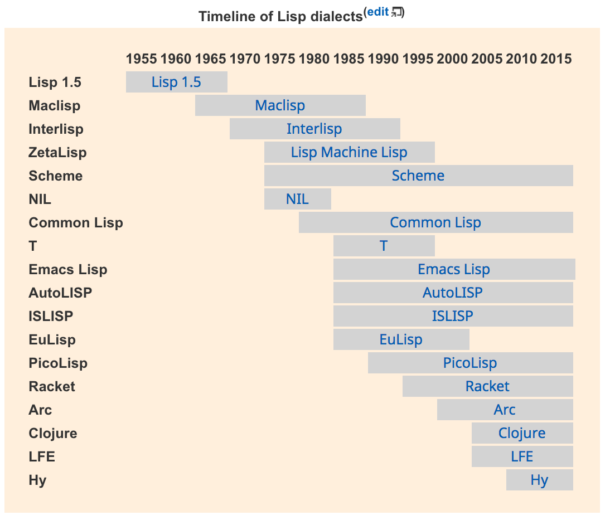

# 说明

这是我的编程语言学习笔记。如果能对你有所帮助，不胜荣幸。

目录：

- 项目清单
  - [Common Framework & Libs](./projects-part-1.md)
  - [Distributed Architecture](./projects-part-2.md)
  - [Data Storage and Analysis](./projects-part-3.md)
  - [DevOps](./projects-part-4.md)
  - [GIS](./projects-part-5.md)
  - [Digital Publishing](./projects-part-6.md)
  - [Security](./projects-part-7.md)
  - [IoT](./projects-part-8.md)
  - [Artificial Intelligence](./projects-part-9.md)
- [Web开发学习笔记](./webdev-learning-notes.md)
- [Python学习笔记](./python-learning-notes.md)
- [Elixir语言学习笔记](./elixir-learning-notes.md)
- [系统设计学习笔记](./system-design-reference.md)
- [常见的网络攻击手段和防御方法](./website-attack-and-defense.md)
- [技术大会介绍和资料](./tech-conference.md)
- [技术论文](./papers.md)

-------------------------------------------------------------------------------

# Fundamental Knowledge

- HTTP
  - [HTTP/2](https://http2.github.io/)
- WebSocket
  - [The WebSocket Protocol](https://tools.ietf.org/html/rfc6455)
  - [WAMP - The Web Application Messaging Protocol](http://wamp-proto.org): WAMP is an open standard WebSocket subprotocol that provides two application messaging patterns in one unified protocol: Remote Procedure Calls + Publish & Subscribe.
- RESTful API
  - [Wikipedia - RESTful API](https://en.wikipedia.org/wiki/Representational_state_transfer)
  - [Richardson Maturity Model](http://martinfowler.com/articles/richardsonMaturityModel.html)
  - [OData](http://www.odata.org/): OData is an OASIS standard for creating and consuming RESTful APIs.
- IoT
  - [Internet of Things Protocols & Standards](http://postscapes.com/internet-of-things-protocols)
  - [Understanding The Protocols Behind The Internet Of Things](http://electronicdesign.com/iot/understanding-protocols-behind-internet-things)
- Bitcoin
  - [Bitcoin Network](https://en.wikipedia.org/wiki/Bitcoin_network)
  - [Bitcoin wiki](https://en.bitcoin.it/wiki/Main_Page)
  - [Bitcoin](https://bitcoin.org/en/): Bitcoin is an innovative payment network and a new kind of money.
- Hypermedia
  - [IPFS](http://ipfs.io): The InterPlanetary File System (IPFS) is a new hypermedia distribution protocol, addressed by content and identities. IPFS enables the creation of completely distributed applications. It aims to make the web faster, safer, and more open.

-------------------------------------------------------------------------------

# Product Design

产品设计相关，我理解的产品设计包含 商业模式设计、用户体验设计、需求分析、业务架构设计、信息架构设计

## 理论

- UI/UE设计理论
  - [Google Material Design](https://www.google.com/design/spec/material-design/introduction.html)
  - [macOS Human Interface Guidelines](https://developer.apple.com/library/prerelease/content/documentation/UserExperience/Conceptual/OSXHIGuidelines/)
  - [iOS Human Interface Guidelines](https://developer.apple.com/ios/human-interface-guidelines/)
      - [中文翻译](https://isux.tencent.com/search/%E4%BA%BA%E6%9C%BA%E7%95%8C%E9%9D%A2%E6%8C%87%E5%8D%97)

## 工具使用

- [系统设计学习笔记](./system-design-reference.md)

-------------------------------------------------------------------------------

# Programming

编程相关

## 技术架构设计

//todo

## Programming Languages Planning to Learn

To master:

- Golang
- Python
  - Julia
  - R
- C
  - Rust
  - C++
- .NET
  - C#
  - F#
- Java

To know about:

- PHP
- Common Lisp
- https://picolisp.com/
- https://nim-lang.org/

### Golang

- Language References
  - [Official Home](https://golang.org/#)
  - Package Finder
    - [GoDoc](https://godoc.org/)
    - [Go libraries and apps](https://golanglibs.com/)
- Guide & News
  - [Official Blog](https://blog.golang.org/)
  - [Going Go Programming](https://www.goinggo.net/)
  - [Golang News](https://golangnews.com/)
- Tools
  - [Go Playground](https://play.golang.org/)
  - [JSON to Go](https://mholt.github.io/json-to-go/)
  - [GoCover](https://gocover.io/): GoCover.io offers the code coverage of any golang package as a service.
  - [Go Report Card](https://goreportcard.com/): A web application that generates a report on the quality of an open source go project.

### Python

- Language References
  - Python
    - [Official Website](https://www.python.org/)
    - [Python Package Index](https://pypi.python.org/pypi)
  - [Julia](https://julialang.org/)
  - [R](https://www.r-project.org/)
- Guide & News
  - [Python Packaging User Guide](https://packaging.python.org/)
- Tools
  - [Intel Distribution for Python](https://software.seek.intel.com/python-distribution)

### C

- Language References
  - [C语言学习笔记](./c-learning-notes.md)
  - [C Course](http://www.geeksforgeeks.org/c/)
  - [C++ Course](http://www.geeksforgeeks.org/c-plus-plus/)
  - [cppreference](http://en.cppreference.com/w/)
  - [Rust](https://www.rust-lang.org/en-US/)
- Guide & News
  - [Google C++ Style Guide](https://google.github.io/styleguide/cppguide.html)
  - [Linux Kernel Coding Style](https://www.kernel.org/doc/html/latest/process/coding-style.html)
  - [A cheatsheet of modern C++ language and library features](https://github.com/AnthonyCalandra/modern-cpp-features)
  - [Meeting Cpp](https://www.meetingcpp.com/index.html)
  - [Bjarne Stroustrup's homepage](http://www.stroustrup.com/index.html)
- Tools
  - [Clang](http://clang.llvm.org/): The goal of the Clang project is to create a new C based language front-end: C, C++, Objective C/C++, OpenCL C and others for the LLVM compiler. You can get and build the source today. C/C++, OpenCL C and others for the LLVM compiler. You can get and build the source today.
  - [CMake](https://cmake.org/): CMake is an open-source, cross-platform family of tools designed to build, test and package software.

### Java

- Language References
  - [Java SE](http://www.oracle.com/technetwork/java/javase/overview/index.html)
  - [Scala](http://www.scala-lang.org/)
  - [Groovy](http://groovy-lang.org/)
  - [AviatorScript](https://github.com/killme2008/aviator): AviatorScript 是一门高性能、轻量级寄宿于 JVM 之上的脚本语言
  - [Clojure](https://clojure.org/)
- Guide & News
  - [Java EE Platform Specification](https://github.com/javaee/javaee-spec)
  - [阿里巴巴Java开发手册](./file/阿里巴巴Java开发手册v1.3.0.pdf)
  - [Google Java Style Guide](https://google.github.io/styleguide/javaguide.html)
  - [Java World](https://www.javaworld.com/)

### .NET

- Language References
  - [Official Home of .NET on GitHub](https://github.com/microsoft/dotnet)
  - [Magic F#](./magic-fsharp.md)
- Guide & News
  - [NET设计规范：约定、惯用法与模式](http://book.douban.com/subject/4231292/)
  - [C# Coding Conventions](https://msdn.microsoft.com/en-us/library/ff926074.aspx)
  - [C# 3.0, C# 4.0 and C# 5.0 Coding Guidelines](http://csharpguidelines.codeplex.com/)
  - [.NET Foundation](http://www.dotnetfoundation.org)
- Tools
  - [Awesome dotNET](https://github.com/quozd/awesome-dotnet)
  - [Mono Projects](https://github.com/mono)

### PHP

- Language References
  - [PHP Manual](http://php.net/manual/en/)
  - [The PHP Package Repository](https://packagist.org/)
- Guide & News
  - [PHP the right way](https://github.com/codeguy/php-the-right-way)
  - [PHP扩展开发及内核应用](https://github.com/walu/phpbook)
  - [PHP7内核剖析](https://github.com/pangudashu/php7-internal)
  - [PHP Framework Interop Group](http://www.php-fig.org/)
- Tools
  - [Composer](https://getcomposer.org/)

### Common Lisp

- Language References
  - [Common Lisp](https://common-lisp.net/index.html)
  - [MIT-Scheme](https://www.gnu.org/software/mit-scheme/)
  - [Racket](http://racket-lang.org/)
- Guide & News
  - [Wiki2 - Scheme (programming language)](https://wiki2.org/en/Scheme_(programming_language))

-------------------------------------------------------------------------------

# DevOps

运维相关

- [Google Shell Style Guide](https://google.github.io/styleguide/shell.xml)
- [Logging best practices](http://dev.splunk.com/view/logging-best-practices/SP-CAAADP6)
- [Open Tracing Project](http://opentracing.io/): Consistent, expressive, vendor-neutral APIs for distributed tracing and context propagation

-------------------------------------------------------------------------------

# Data & Insight & Intelligence

数据收集、存储、处理、分析相关

- [Bad Data Guide](https://github.com/Quartz/bad-data-guide): An exhaustive reference to problems seen in real-world data along with suggestions on how to resolve them.

-------------------------------------------------------------------------------

# Books that I Have Read

## Common

- [Head First Object-Oriented Analysis and Design](https://book.douban.com/subject/1761742/)
- [Head First Design Patterns](https://book.douban.com/subject/1400656/)
- [重构 - Martin Fowler](https://book.douban.com/subject/4262627/)

## .NET Framework

- [CLR via C#](http://book.douban.com/subject/4924165/)
- [微软应用架构指南](https://book.douban.com/subject/5362857/)
- [Threading in C#](http://www.albahari.com/threading/)

-------------------------------------------------------------------------------

# References

- [Open Source Testing](http://www.opensourcetesting.org/)
- [NoSQL Database](http://nosql-database.org/)
- [amplab - UC BERKELEY](https://amplab.cs.berkeley.edu/)
- [A Complete List of .NET Open Source Developer Projects](http://scottge.net/2015/07/08/a-complete-list-of-net-open-source-developer-projects/)
- [Essential JavaScript website](https://github.com/ericelliott/essential-javascript-links)
- [Google Style Guide](https://github.com/google/styleguide):  Style guides for Google-originated open-source projects
