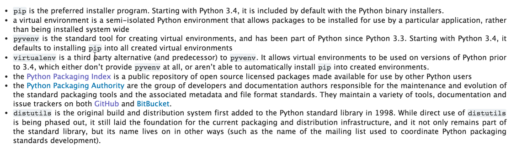

# 如何搭建开发环境

以Mac OS X为例

## 安装

（参考了[Python Setup and Usage](https://docs.python.org/2/using/index.html)上的Macintosh下的安装说明）

Mac OS X Yosemite自带Python 2.7.6，安装在`/System/Library/Frameworks/Python.framework`和`/usr/bin/python`目录下，它们是Apple控制的，由Apple或者第三方的应用程序使用，请不要修改或者删除。如果要安装最新版本的Python，参考下面的步骤操作：
- 先安装Homebrew，安装方法见[brew的官网](http://brew.sh/)。
- 通过执行"brew install python"安装最新的2.n版的Python。
- 如果要安装Python3需要执行"brew install python3"命令。


通常情况下，我们会在系统中同时安装多个版本的Python运行环境，可以参考下面的步骤：


## 编辑器和IDE

(参考了https://wiki.python.org/moin/IntegratedDevelopmentEnvironments)

下面列出了，我倾向使用和正在使用的编辑软件和IDE：

- [Vim](http://www.vim.org/)
- [Visual Studio Code](https://code.visualstudio.com/)
- [Emacs](http://www.gnu.org/software/emacs/)
- [Atom](https://atom.io/)
- [PyCharm](https://www.jetbrains.com/pycharm/)

如果想把Xcode作为Python的IDE，可以参考[这篇文章](http://blog.netsh.org/posts/xcode-python_1846.netsh.html)。

## 编译运行

### 以交互方式执行Python代码

在Terminal中输入"Python"，然后输入Python命令运行：  


### 运行Python代码脚本

可以像如下方式运行Python脚本：

```sh
python [-BdEiOQsRStuUvVWxX3?] [-c command | -m module-name | script | - ] [args]
```

常见的情况是直接运行Python脚本：

```sh
python myscript.py
```

Python命令运行参数见[Command line and environment](https://docs.python.org/2/using/cmdline.html)

## 包管理机制

请阅读https://docs.python.org/3/installing/index.html，下面是一些关键概念截图  


pip是推荐的包管理工具。从Python3.4开始，它自动包含在Python的二进制安装包中。

- [pip的文档](https://pip.pypa.io/en/stable/index.html)

## 构建和发布

参考：
- [Python如何连同依赖打包发布以及python的构建工具？](http://www.zhihu.com/question/21639330)
- [Python应用发布技术](http://wiki.woodpecker.org.cn/moin/PyExe)
- [Python打包指南](http://www.ibm.com/developerworks/cn/opensource/os-pythonpackaging/)


------------------------

# 关注的Python Module

参考：

- [the index of python popular modules](http://www.programcreek.com/python/index/module/list)
- [The Most Popular Scientific Python Modules](http://www.s-anand.net/blog/the-most-popular-scientific-python-modules/)
- [Python: 50 modules for all needs](http://www.catswhocode.com/blog/python-50-modules-for-all-needs)

## Math

- [Scipy](https://github.com/scipy/scipy): SciPy (pronounced "Sigh Pie") is open-source software for mathematics, science, and engineering. It includes modules for statistics, optimization, integration, linear algebra, Fourier transforms, signal and image processing, ODE solvers, and more.
- [NumPy](http://www.numpy.org): NumPy is the fundamental package for scientific computing with Python.

## Software Test

- [pyunit](http://pyunit.sourceforge.net/pyunit.html): Python Unit Testing Framework
- [ROBOT FRAMEWORK](http://robotframework.org): Robot Framework is a generic test automation framework for acceptance testing and acceptance test-driven development (ATDD).
- [Twill](https://pypi.python.org/pypi/twill): A scripting system for automating Web browsing. Useful for testing Web pages or grabbing data from password-protected sites automatically.
- [Ghost.py](https://github.com/jeanphix/Ghost.py): Webkit based scriptable web browser for python.

## Network

- [Twisted](https://pypi.python.org/pypi/Twisted): An event-driven networking engine for Python. Twisted implements a variety of networking and communication protocols and exposes them all as method-calls on your Python objects. Client and server implementations are provided for various standard protocols, including:
    - HTTP (twisted.web)
    - IMAP, POP, SMTP (twisted.mail)
    - DNS (twisted.names)
    - TLS (core)
    - SSH, Telnet (twisted.conch)
    - IRC, XMPP, OSCAR (twisted.words)
    - Ethernet, IP, TUN/TAP (twisted.pair)
    - NMEA (twisted.positioning)
- [mitmproxy](https://mitmproxy.org/index.html): An interactive console program that allows traffic flows to be intercepted, inspected, modified and replayed.

## Development Framework

- [django](https://www.djangoproject.com): Django is a high-level Python Web framework that encourages rapid development and clean, pragmatic design. Built by experienced developers, it takes care of much of the hassle of Web development, so you can focus on writing your app without needing to reinvent the wheel. It’s free and open source.
- [tornado](https://github.com/tornadoweb/tornado): Tornado is a Python web framework and asynchronous networking library, originally developed at FriendFeed. By using non-blocking network I/O, Tornado can scale to tens of thousands of open connections, making it ideal for long polling, WebSockets, and other applications that require a long-lived connection to each user.
- [web.py](http://webpy.org): web.py is a web framework for Python that is as simple as it is powerful. web.py is in the public domain; you can use it for whatever purpose with absolutely no restrictions.
- [Bottle](http://bottlepy.org/docs/dev/index.html): Bottle is a fast, simple and lightweight WSGI micro web-framework for Python. It is distributed as a single file module and has no dependencies other than the Python Standard Library.
- [Flask](http://flask.pocoo.org): Flask is a microframework for Python based on Werkzeug, Jinja 2 and good intentions. And before you ask: It's BSD licensed!
- [eve](http://python-eve.org/index.html): Python REST API Framework

## RESTful API Client

- [RestClient](https://github.com/timothycrosley/RestClient): A Simple RestClient for Python - Works With AppEngine
- [dRest](http://drest.readthedocs.org/en/latest/): dRest is a configurable HTTP/REST client library for Python. It’s goal is to make the creation of API clients dead simple, without lacking features.
- [crest](https://github.com/RussellLuo/crest): A simple REST client for Python.
- [restle](https://github.com/consbio/restle): Restle (pronounced like "wrestle") helps you create client interfaces for REST resources. If you've used the Django ORM or other relation mappers, the syntax should look familiar.

## Natural Language Processing

- [spaCy](http://spacy.io): spaCy is a library for industrial-strength natural language processing in Python and Cython. It features state-of-the-art speed and accuracy, a concise API, and great documentation.

## Language

- [Pypy](http://pypy.org/index.html): PyPy is a fast, compliant alternative implementation of the Python language (2.7.9 and 3.2.5). It has several advantages and distinct features: Speed, Memory usage, Compatibility, Stackless, as well as other features.
    - [PyPy 为什么会比 CPython 还要快？](http://www.zhihu.com/question/19588346)
    - [Differences between PyPy and CPython](http://pypy.readthedocs.org/en/latest/cpython_differences.html)

## IoT

- [Home Assistant](https://home-assistant.io): Home Assistant is an open-source home automation platform running on Python 3. Track and control all devices at home and automate control. Installation in less than a minute.

## GIS

- [Geodis](https://github.com/EverythingMe/geodis): Geodis is a simple and fast python module that allows you to convert IP addresses and latitude/longitude coordinates into geographical locations such as cities, zipcodes and countries.

------------------------

# 学习书籍

- [Learning Python](http://book.douban.com/subject/3988517/)：深入的探讨了Python编程的基本知识。它集中研究Python语言的核心，并且其主题是阅读下面一本书的的前提条件。
- [Programming Python](http://book.douban.com/subject/4893005/)：涉及Python 在现实世界编程任务中的应用。这本书关注程序库和工具，并且认为你已经了解Python的基础知识。
- [Python Pocket Reference](http://book.douban.com/subject/4074478/)：上面两本书没有详尽列出的细节提供快速参考。虽然讲的不多，但可以帮助快速查找细节。
- [Python Cookbook](http://book.douban.com/subject/4828875/)：本书介绍了Python应用在各个领域中的一些使用技巧和方法，从最基本的字符、文件序列、字典和排序，到进阶的面向对象编程、数据库和数据持久化、 XML处理和Web编程，再到比较高级和抽象的描述符、装饰器、元类、迭代器和生成器，均有涉及。书中还介绍了一些第三方包和库的使用，包括 Twisted、GIL、PyWin32等。本书覆盖了Python应用中的很多常见问题，并提出了通用的解决方案。书中的代码和方法具有很强的实用性，可以方便地应用到实际的项目中，并产生立竿见影的效果。尤为难得的是，本书的各位作者都具有丰富的业界实践经验，因此，本书不仅给出了对各种问题的解决方案，同时还体现了很多专家的思维方式和良好的编程习惯，与具体的细节性知识相比，这部分内容无疑是本书的精华。本书适合具有一定Python基础的读者阅读参考。
- [Dive to Python](http://www.diveintopython.net/)：（[中文版](http://woodpecker.org.cn/diveintopython/index.html)）， “Dive Into Python” is a free Python book for experienced programmers
- [Dive to Python 3](http://www.diveintopython3.net/)：Dive Into Python 3 covers Python 3 and its differences from Python 2. Compared to Dive Into Python, it’s about 20% revised and 80% new material.
- [Python源码剖析](http://book.douban.com/subject/3117898/)：作为主流的动态语言，Python不仅简单易学、移植性好，而且拥有强大丰富的库的支持。此外，Python强大的可扩展性，让开发人员既可以非常容易地利用C/C++编写Python的扩展模块，还能将Python嵌入到C/C++程序中，为自己的系统添加动态扩展和动态编程的能力。为了更好地利用Python语言，无论是使用Python语言本身，还是将Python与C/C++交互使用，深刻理解Python的运行原理都是非常重要的。本书以CPython为研究对象，在C代码一级，深入细致地剖析了Python的实现。书中不仅包括了对大量Python内置对象的剖析，更将大量的篇幅用于对Python虚拟机及Python高级特性的剖析。通过此书，读者能够透彻地理解Python中的一般表达式、控制结构、异常机制、类机制、多线程机制、模块的动态加载机制、内存管理机制等核心技术的运行原理，同时，本书所揭示的动态语言的核心技术对于理解其他动态语言，如 Javascript、Ruby等也有较大的参考价值。本书适合于Python程序员、动态语言爱好者、C程序员阅读
- [Foundations of Python Network Programming](https://github.com/brandon-rhodes/fopnp)
- [Programming Computer Vision with Python](http://book.douban.com/subject/10574101/)：《python计算机视觉编程》是计算机视觉编程的权威实践指南，依赖python语言讲解了基础理论与算法，并通过大量示例细致分析了对象识别、基于内容的图像搜索、光学字符识别、光流法、跟踪、三维重建、立体成像、增强现实、姿态估计、全景创建、图像分割、降噪、图像分组等技术。另外，书中附带的练习还能让读者巩固并学会应用编程知识。《python计算机视觉编程》适合的读者是：有一定编程与数学基础，想要了解计算机视觉的基本理论与算法的学生，以及计算机科学、信号处理、物理学、应用数学和统计学、神经生理学、认知科学等领域的研究人员和从业者。
- [Natural Language Processing with Python](http://book.douban.com/subject/5336893/)：提供了非常易学的自然语言处理入门介绍，该领域涵盖从文本和电子邮件预测过滤，到自动总结和翻译等多种语言处理技术。在本书中，你将学会编写Python程序处理大量非结构化文本。你还将通过使用综合语言数据结构访问含有丰富注释的数据集，理解用于分析书面通信内容和结构的主要算法。
- [Text Processing in Python](http://gnosis.cx/TPiP/): IBM dW Python 专栏作家 David Mertz 的作品，主页上有免费的在线版本和补充资料。
    - [某位读者关于 High Order Functions 的若干笔记](http://wiki.python.org/moin/TextProcessingInPython)


------------------------

# 参考

- [Awesome-python](https://github.com/vinta/awesome-python)
- [Community for Python Developer](http://www.oss.io/Python/top-projects)
- 官方资源
    - [官方站点](https://www.python.org/)
        - [Python 3.x文档](https://docs.python.org/3/)
        - [Python 2.x文档](https://docs.python.org/2/)
    - [Python的包索引](https://pypi.python.org/pypi)
    - [Python Wiki](https://wiki.python.org/moin/FrontPage)
- 多个版本的Python运行环境
    - [pyenv](https://github.com/pyenv/pyenv): pyenv lets you easily switch between multiple versions of Python
    - [virtualenv](https://github.com/pypa/virtualenv): a tool to create isolated Python environments
    - [使用pipenv管理你的项目](https://mp.weixin.qq.com/s/uHDqRSDjsvfOmH1wpEH7SQ)
    - [What is the difference between venv, pyvenv, pyenv, virtualenv, virtualenvwrapper, pipenv, etc?](https://stackoverflow.com/questions/41573587/what-is-the-difference-between-venv-pyvenv-pyenv-virtualenv-virtualenvwrappe)
    - [Better Python version and environment management with pyenv](http://fgimian.github.io/blog/2014/04/20/better-python-version-and-environment-management-with-pyenv/)
    - [Ultimate Solution to Python Virtual Environments: pyenv + virtualenvwrapper](https://alysivji.github.io/setting-up-pyenv-virtualenvwrapper.html)
